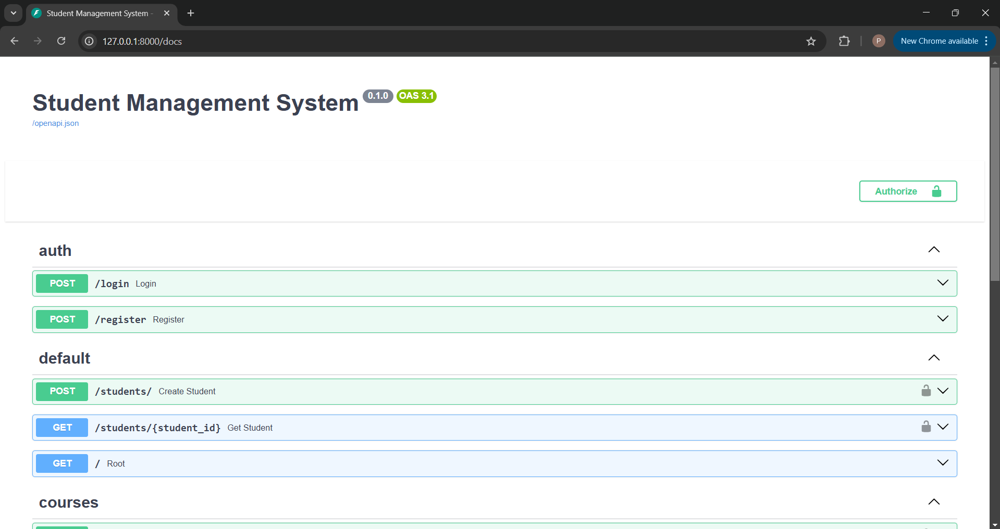

# Student Management System API

A  🚀FastAPI-based REST API for managing students, courses, and enrollments with JWT authentication.

## Features

- 🔐 JWT Authentication
- 👥 User Management (Register/Login)
- 📚 Course Management
- 🎓 Student Management
- 📝 Enrollment System
- 🔄 Async Database Operations
- 🗄️ SQLite Database with Async Support

## Tech Stack

- **FastAPI**: Modern, fast web framework for building APIs
- **SQLAlchemy**: SQL toolkit and ORM
- **Alembic**: Database migration tool
- **Pydantic**: Data validation using Python type annotations
- **JWT**: JSON Web Tokens for authentication
- **SQLite**: Lightweight database
- **Bcrypt**: Password hashing

## 📖API Endpoints

### Authentication
- `POST /login`: Authenticate user and get JWT token
- `POST /register`: Register new user

### Students
- `POST /students/`: Create new student
- `GET /students/{student_id}`: Get student details

### Courses
- `POST /courses/`: Create new course
- `GET /courses/{course_id}`: Get course details

### Enrollments
- `POST /enrollments/`: Enroll student in course
- `GET /enrollments/students/{student_id}/courses`: Get student's enrolled courses

## Installation & Setup

1️⃣**Clone the repository**
   ```bash
   git clone <repository-url>
   cd student-management-system
   ```

2️⃣ **Create and activate virtual environment**
   ```bash
   python -m venv venv
   source venv/bin/activate  # On Windows: venv\Scripts\activate
   ```

3️⃣ **Install dependencies**
   ```bash
   pip install -r requirements.txt
   ```

4️⃣ **Set up the database**
   ```bash
   alembic upgrade head
   ```

5️⃣ **Run the application**
   ```bash
   uvicorn app.main:app --reload
   ```

The API will be available at `http://localhost:8000`

## API Documentation

Once the server is running, you can access:
- Interactive API documentation: `http://localhost:8000/docs`

## Authentication Flow

1. Register a new user using `/register` endpoint
2. Login using `/login` endpoint to receive JWT token
3. Include token in Authorization header for protected endpoints:
   ```
   Authorization: Bearer <your-token>
   ```

## Project Structure
<div style="font-family: monospace; white-space: pre;">
├── <strong>app/</strong>
│   ├── <strong>models/</strong> # Database models
│   ├── <strong>routes/</strong> # API endpoints
│   ├── <strong>schemas/</strong> # Pydantic models
│   ├── <strong>database/</strong> # Database configuration
│   ├── <strong>auth.py</strong> # Authentication logic
│   └── <strong>main.py</strong> # FastAPI application
├── <strong>tests/</strong> # Test cases
└── <strong>alembic.ini</strong> # Alembic configuration
</div>


